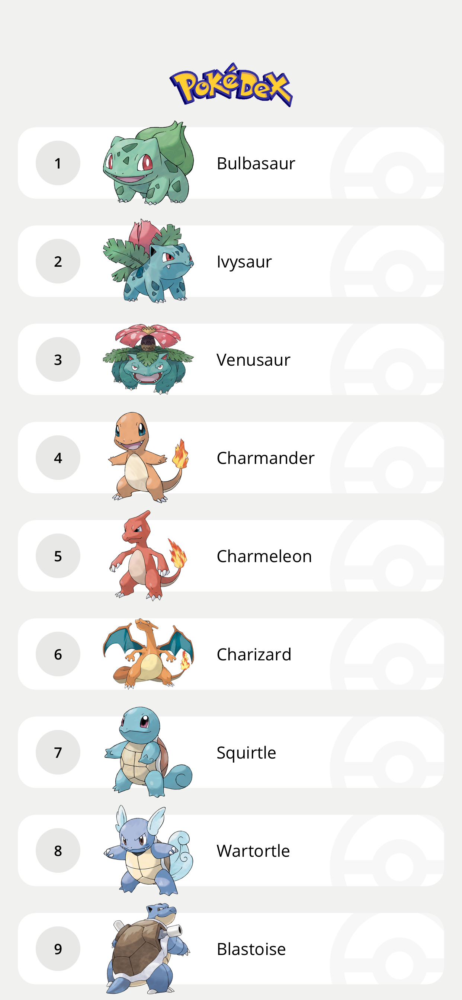

# Pokédex
Pokédex is an iOS application that interacts with the Pokemon API.

  
  
  
  

# Features
- List of Pokemon from the Kanto region.

# Architecture
- VIPER

# Code
- Swift
- SwiftUI
- Combine

# 3rd party libraries
- Swinject
- Kingfisher
- SwiftLint

# Unit testing
- SwiftyMocky (+Sourcery)

# UI testing
- SnapshotTesting

# Requirements
- iOS 15.5+
- Swift 5.0+

# License
Copyright 2023 Jordi Gámez
